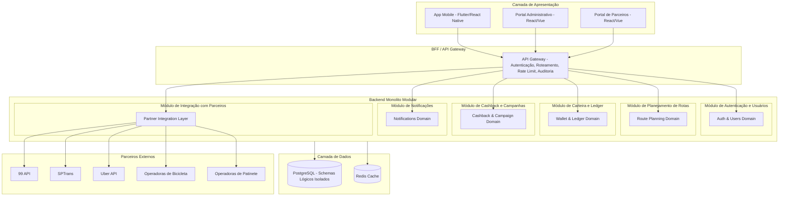

# Arquitetura do Sistema e Decisões de Alto Nível (ADRs) — MaaS Wallet

Este documento define a arquitetura do sistema MaaS Wallet, descrevendo os módulos constituintes, a estratégia de persistência, padrões de integração e as decisões arquiteturais formais (ADRs).

---

## 1. Visão Geral da Arquitetura

O sistema é desenhado como um **Monolito Modular** (Modular Monolith). Esta escolha visa garantir consistência transacional rápida, facilidade de deploy inicial e redução da complexidade de rede, enquanto impõe limites claros entre domínios (Bounded Contexts) que permitirão a migração para microsserviços caso necessário.

Cada módulo interno opera de forma isolada seguindo os princípios de **Clean/Hexagonal Architecture**, garantindo que as regras de negócio de domínio estejam totalmente desacopladas de frameworks, bibliotecas e drivers de banco de dados.

---

## 2. Visão Detalhada dos Módulos

O backend é subdividido em 6 módulos funcionais com isolamento estrito de código e dados:

### 2.1. Módulo de Autenticação e Usuários (`auth-user`)
* **Responsabilidade**: Cadastro de usuários, preferências de mobilidade, gerenciamento de perfil, autenticação via OAuth2/JWT e controle de acesso baseado em papéis (RBAC).
* **Isolamento**: Armazena credenciais (com hash seguro bcrypt) e informações cadastrais. Não possui acesso direto ao saldo da carteira.

### 2.2. Módulo de Planejamento de Rotas (`route-planning`)
* **Responsabilidade**: Consultar o módulo de integrações, buscar opções de transporte multimodal de ponto A a ponto B, ordenar e comparar rotas por tempo de trajeto, custo financeiro e potencial de cashback.
* **Isolamento**: Módulo puramente computacional e de leitura de dados externos. Utiliza cache intensivo para evitar requisições redundantes aos parceiros.

### 2.3. Módulo de Carteira e Ledger (`wallet-ledger`)
* **Responsabilidade**: Gerenciamento de saldos (disponível, bloqueado e de cashback) e registro imutável de transações financeiras.
* **Isolamento**: **O coração financeiro do sistema.** Nenhuma alteração de saldo ocorre sem um lançamento correspondente e imutável no ledger. Este módulo possui transações isoladas e mecanismos de conciliação.

### 2.4. Módulo de Cashback e Campanhas (`cashback-campaign`)
* **Responsabilidade**: Criação, ativação e verificação de regras de elegibilidade para campanhas de cashback. Cálculo da recompensa após a cotação da viagem.
* **Isolamento**: Comunica-se com o módulo de rotas para informar projeções de cashback e com o módulo de carteira para liberar os créditos após a validação da conclusão da viagem.

### 2.5. Módulo de Notificações (`notifications`)
* **Responsabilidade**: Disparo de push notifications, e-mails ou SMS referentes a status de viagens, confirmação de recarga, alertas de saldo baixo e alertas de segurança.
* **Isolamento**: Funciona de forma assíncrona por meio de consumo de eventos internos do sistema.

### 2.6. Módulo de Integração com Parceiros (`partner-integration`)
* **Responsabilidade**: Padronizar as APIs proprietárias de terceiros (SPTrans, Uber, 99, APIs de Bikes e Patinetes) em um formato interno unificado.
* **Isolamento**: Isola o restante do sistema contra quebras e mudanças de contratos nas APIs externas. Gerencia a resiliência (Circuit Breakers) das chamadas aos parceiros.

---

## 3. Decisões Arquiteturais Registradas (ADRs)

### ADR 001: Escolha do Monolito Modular
* **Contexto**: A plataforma MaaS Wallet lida com múltiplos domínios integrados, mas necessita de consistência rígida (especialmente no ledger) e baixo custo operacional inicial de infraestrutura.
* **Decisão**: Adotar um Monolito Modular. O código deve ser segregado fisicamente em módulos Maven distintos (ou subprojetos Gradle) que impedem referências cíclicas.
* **Consequências**: 
  - Deploy em um único artefato JAR executável.
  - Facilidade de refatoração de contratos de API internos.
  - Prontidão para separação física de serviços no futuro, se necessário.

### ADR 002: Livro-Razão Imutável (Ledger) para Registro Financeiro
* **Contexto**: O sistema lida com saldos, créditos pré-pagos e cashback. Atualizações diretas de saldo via comando `UPDATE wallet SET balance = balance + x` são suscetíveis a inconsistências, race conditions e dificultam auditorias financeiras.
* **Decisão**: Toda alteração financeira deve ser registrada por meio de lançamentos de débito/crédito na tabela `ledger_entry`, a qual é estritamente **somente-leitura (append-only)**. O saldo real de um usuário é calculado a partir da soma histórica dos lançamentos, embora caches ou tabelas de saldo consolidado possam ser utilizados para otimização sob controle transacional rígido.
* **Consequências**:
  - Rastreabilidade total de todas as ações financeiras.
  - Imutabilidade física dos dados de auditoria (não são permitidos `UPDATE` ou `DELETE` no ledger).
  - Estornos são obrigatoriamente novas transações com sinal invertido apontando para o ID da transação original.

### ADR 003: Idempotência de Webhooks de Status de Viagem
* **Contexto**: Operadoras de mobilidade enviam atualizações de status de viagens (conclusão, cancelamento) via webhooks REST. Falhas de rede ou retentativas automáticas podem enviar o mesmo webhook múltiplas vezes, o que geraria duplo débito ou duplo pagamento de cashback.
* **Decisão**: Todos os endpoints de webhook expostos para parceiros devem exigir um cabeçalho `Idempotency-Key` ou deduzir a chave com base no par `partner_id` + `partner_trip_id`. O sistema deve rastrear e armazenar os IDs de webhooks processados no Redis/Banco de dados por pelo menos 48 horas.
* **Consequências**:
  - Garantia de que cada evento de viagem é processado exatamente uma vez.
  - Redução drástica de inconsistências financeiras com parceiros de mobilidade.

### ADR 004: Isolamento de Dados por Esquemas Lógicos (Logical Schema Isolation)
* **Contexto**: Em um monolito, o compartilhamento direto de tabelas de banco de dados entre domínios quebra o encapsulamento e impede a migração futura para microsserviços.
* **Decisão**: Utilizar esquemas lógicos separados no PostgreSQL para cada módulo (ex.: schema `auth`, schema `wallet`, schema `campaigns`). Consultas cross-schema via SQL JOINs são **terminantemente proibidas**. Dados necessários de outros módulos devem ser obtidos através de comunicação de API interna ou replicação de eventos.
* **Consequências**:
  - Desacoplamento físico e lógico do banco de dados.
  - Flexibilidade para migrar módulos específicos para instâncias de bancos de dados independentes no futuro.

---

## 4. Segurança e Conformidade (LGPD)

* **Autenticação e Autorização**: Implementação de OAuth2 com tokens JWT contendo reivindicações de papéis (roles) para aplicação de RBAC (Role-Based Access Control) diretamente nos recursos de API.
* **Logs de Auditoria**: Qualquer operação administrativa ou financeira crítica deve gerar um log de auditoria estruturado contendo: timestamp, ID do operador, tipo de ação, ID do recurso afetado e IP de origem.
* **Criptografia**: Dados sensíveis (como CPFs de usuários e chaves de parceiros) devem ser armazenados com criptografia em repouso (AES-256) na camada de dados.
* **Conformidade LGPD**: Implementação de mecanismos de minimização de dados e exportação/anonimização de dados de usuários mediante solicitação, garantindo que relatórios corporativos contenham apenas dados consolidados e não identificáveis.

---

## 5. Prompts Originais de Arquitetura

Para fins de consistência conceitual, seguem os prompts exatos utilizados na concepção e refinamento desta arquitetura (seção 11 do documento original):

1. **Prompt 1 (Visão Inicial)**: 
   > "Crie a arquitetura de um sistema MaaS para uma startup de mobilidade urbana que administra créditos de transporte multimodal em uma carteira única. A solução deve integrar transporte público, Uber, 99, bicicletas e patinetes, permitindo pagamento, planejamento de rotas e cashback. Considere regras de negócio, segurança, LGPD e integração com parceiros externos."
2. **Prompt 2 (Camadas e Mermaid)**: 
   > "Defina uma arquitetura em camadas para o sistema MaaS, contendo frontend, backend, banco de dados, camada de integração, autenticação, carteira digital, motor de cashback e APIs externas. Use Mermaid para representar o diagrama."
3. **Prompt 3 (Entidades e Endpoints)**: 
   > "Modele as principais entidades e relacionamentos do sistema, incluindo usuário, carteira, transação, parceiro, modal, produto de mobilidade, viagem, cashback e campanha. Crie também os principais endpoints REST para implementação."
4. **Prompt 4 (Fluxos e Regras Críticas)**: 
   > "Liste as regras de negócio críticas para uma carteira de créditos multimodal com cashback e descreva os fluxos principais de cadastro, recarga, planejamento de viagem, pagamento, confirmação por parceiro e crédito de cashback."
